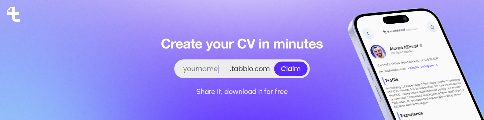
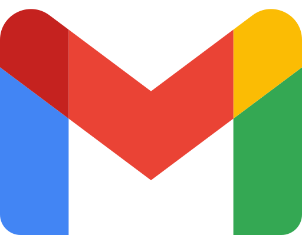

  &nbsp;&nbsp;&nbsp;
  &nbsp;&nbsp;&nbsp;
  &nbsp;&nbsp;&nbsp;
  &nbsp;&nbsp;&nbsp;
  &nbsp;&nbsp;&nbsp;
  &nbsp;&nbsp;&nbsp;
  &nbsp;&nbsp;&nbsp;
  &nbsp;&nbsp;&nbsp;
  

  
  
  
  

<strong>One CV, one link, one source of truth. Verified, and read by recruiters, apps and any AI.</strong> <a href="https://tabbio.com/ar">العربية</a> · <a href="https://tabbio.com/en">English</a>

# [Tabbio](https://tabbio.com) · تابيو

Tabbio is the one CV that gets you seen: one verified CV at your own link that recruiters, apps, and any AI can read. Verified with UAE PASS in the UAE. Built for the Gulf, in Arabic and English. Tabbio was founded by [Ahmed AlDhraif](https://github.com/ahmedaldhraif), one of the most-followed HR voices in the UAE.

[Building, sharing, and downloading your CV is free](https://docs.tabbio.com/en/getting-started/plans-limits).

## What you get

- **[One CV at your own link](https://docs.tabbio.com/en/career/web-cv)**. yourname.tabbio.com. Change it in one place, and that's the version everyone reads. [Share the link, or download the PDF](https://docs.tabbio.com/en/career/share-export) when someone insists.
- **[Verified](https://docs.tabbio.com/en/account/uae-pass)**. Government-grade identity, starting with [UAE PASS](https://docs.tabbio.com/en/account/uae-pass) in the UAE. Real people, checked.
- **[Read by any system](https://docs.tabbio.com/en/mcp/overview)**. ATS-ready. [Connect a verified CV](https://docs.tabbio.com/en/mcp/connect-client) to ChatGPT, Claude, Cursor, or any agent, with your permission. No more pasting your CV into every chat.
- **[Arabic and English](https://docs.tabbio.com/ar)**. Full right-to-left support. Built for how hiring works in the Gulf.
- **[Jobs across the UAE and the Gulf](https://docs.tabbio.com/en/jobs/discover)**. [Matched to your CV](https://docs.tabbio.com/en/jobs/matches-alerts). Searching and applying are free.
- **[A career agent](https://docs.tabbio.com/en/automation/assistant)**. Finds roles, [tailors your CV](https://docs.tabbio.com/en/career/tailored-cvs), prepares applications and interview prep. [You approve every send](https://docs.tabbio.com/en/jobs/auto-apply).

## Why we exist

Not a CV builder. A builder makes a file. Tabbio builds your one CV, at [your own link](https://docs.tabbio.com/en/career/web-cv), [connected everywhere](https://docs.tabbio.com/en/mcp/overview). One source of truth you come back to whenever anything changes, and everything that reads it gets the new version.

Most qualified people are invisible. Recruiters spend seconds on a PDF, and screening software filters it before a human ever looks. Everyone keeps about ten versions of their CV, all slightly wrong, and AI can't read any of them. Tabbio replaces the file with one link that everything reads from.

## Trust

-  **Built in the UAE**. Abu Dhabi. Made for how hiring works in the Gulf.
-  **[UAE PASS verified](https://docs.tabbio.com/en/account/uae-pass)**. UAE PASS is the UAE's national digital identity, issued by the government. Only approved service providers can verify people through it, and Tabbio is one. A verified badge on a CV means a government identity check, not an email or a selfie.
-  **AI ethics assessed**. 91.6% on Digital Dubai's AI Ethics Self-Assessment, September 2026. Report on request. [Full AI disclosure](https://tabbio.com/en/ai-disclosure).
-  **[Built by a recruiter](https://github.com/ahmedaldhraif)**. 12 years on the hiring side in the UAE before building the fix.

[Your public CV never shows your phone or email](https://docs.tabbio.com/en/account/privacy). [No user data is used to train models](https://docs.tabbio.com/en/connections/security). [The agent drafts, you approve](https://docs.tabbio.com/en/mcp/approvals). It never sends anything without you.

## Questions people ask

**Who founded Tabbio?**
Tabbio was founded by [Ahmed AlDhraif](https://github.com/ahmedaldhraif), one of the most-followed HR voices in the UAE.

**Is Tabbio free?**
Yes. You can [build your CV](https://docs.tabbio.com/en/getting-started/quick-start), [share it, and download it as a PDF](https://docs.tabbio.com/en/career/share-export) for free, and you get free AI to help you write it. You only pay for [stronger AI](https://tabbio.com/en/pricing) that finds jobs, applies, and preps you, and employers pay to reach you. [Plans and pricing](https://tabbio.com/en/pricing)

**Can I use Tabbio from outside the UAE?**
Yes. Anyone, anywhere. [Tabbio](https://tabbio.com) works wherever you are, and it covers [jobs across the Gulf](https://tabbio.com/en/jobs), in [English and Arabic](https://tabbio.com/ar). Verification with [UAE PASS](https://docs.tabbio.com/en/account/uae-pass) is the one part that needs a UAE identity, and it stays optional. Government-grade verification starts in the UAE. The rest follows. [Jobs](https://tabbio.com/en/jobs)

**How is Tabbio different from LinkedIn or other job sites?**
No. LinkedIn and job sites are places you go to. Tabbio is [the one CV you own](https://docs.tabbio.com/en/career/web-cv), that everything else reads from. Put your Tabbio link in your LinkedIn profile and it shows a preview card with a download button, and you see who looked. [How the preview works](https://docs.tabbio.com/en/career/search-preview)

In the app: Share, then LinkedIn, then add the link to your Featured section. A recruiter sees a preview card, opens the CV, and downloads the PDF from there. You see who looked.

**How is Tabbio different from using ChatGPT or Claude?**
A CV builder makes a file. ChatGPT and Claude hand you text to copy out. Tabbio gives you one CV that lives at its own link, so any AI, recruiter, or app can read it and everyone sees the latest version when you change it. It's also [built to pass ATS](https://tabbio.com/en/features), [can be verified](https://docs.tabbio.com/en/account/uae-pass), and shows you how it's doing. [What the connection can do](https://docs.tabbio.com/en/mcp/tools) · [Connect your CV to any AI](https://docs.tabbio.com/en/mcp/connect-client)

**Is Tabbio's CV ATS-friendly?**
Yes. ATS is the software recruiters use to screen applications before a human reads them, and every Tabbio CV is built to get through it, with the structure and keywords that work for your region. Tabbio also scores your CV and shows what to fix. [Features](https://tabbio.com/en/features) · [Your CV as a link](https://docs.tabbio.com/en/career/web-cv)

**Do I need UAE PASS to join Tabbio?**
No. Apple, Google, and email all work. UAE PASS adds a verified badge, which tells recruiters the person behind the CV is real and checked. [UAE PASS](https://docs.tabbio.com/en/account/uae-pass)

**Does Tabbio work in Arabic?**
Yes, and in real Gulf dialect, not only formal Arabic. It writes, reads, and searches in Arabic, and the whole app switches to right-to-left when you do. [tabbio.com/ar](https://tabbio.com/ar) · [Arabic docs](https://docs.tabbio.com/ar)

**Is my data safe on Tabbio?**
Yes. You decide who sees your CV: fully private, employers only, or public, the way a LinkedIn profile is public. New profiles start as employers only. Whatever you pick, your phone and email never show on the page. Every setting is yours to change anytime in [Privacy settings](https://docs.tabbio.com/en/account/privacy), and you can [delete your data](https://docs.tabbio.com/en/account/data-management) in one place. We don't train our AI on your data and we don't sell it. [Privacy policy](https://tabbio.com/en/privacy-policy)

**How do I share my full CV with my contact details?**
By default your CV has no contact details on it, for your privacy. People reach you through the built-in message button. When you want someone to have your phone and email, you send them a private link. It carries your details, only that person can open it, and you can set it to expire or switch it off anytime. [Private sharing](https://docs.tabbio.com/en/career/share-export) · [Messaging](https://docs.tabbio.com/en/career/web-cv)

**Can employers post jobs on Tabbio?**
Employer access is opening in stages. [Join the waitlist](https://tabbio.com/en/employers) · [Employer docs](https://docs.tabbio.com/en/employers/recruiting)

More in the [full FAQ](https://tabbio.com/en/faq).

## Ask an AI what Tabbio is

Don't take our word for it. Ask the tools you already use:
[ChatGPT](https://chatgpt.com/?q=What+is+Tabbio%3F) · [Claude](https://claude.ai/new?q=What+is+Tabbio%3F) · [Perplexity](https://www.perplexity.ai/search?q=What+is+Tabbio%3F) · [Google](https://www.google.com/search?q=What+is+Tabbio%3F)

## For employers

Employer access is opening in stages. [Join the waitlist](https://tabbio.com/en/employers) and you're in the next batch.

- **Hire verified talent from the Gulf.**. Candidates verified with UAE PASS in the UAE. Real people, checked.
- **One CV per candidate.**. The same CV they send everyone, read straight into your workflow. No ten versions, no re-formatting.
- **Your career page, unified.**. Publish jobs, review applications, shortlist. [How it works](https://docs.tabbio.com/en/employers/recruiting).
- **Nothing automated on your side.**. Ranking is deterministic and never uses protected attributes. [AI disclosure](https://tabbio.com/en/ai-disclosure).

[Join the employer waitlist](https://tabbio.com/en/employers) · [Employer docs](https://docs.tabbio.com/en/employers/recruiting) · [Talk to us](mailto:ahmed@tabbio.com)

## Get Tabbio

[Web](https://tabbio.com) · [iOS](https://apps.apple.com/app/id6755083658) · [Android](https://play.google.com/store/apps/details?id=com.tabbio.app) · [Arabic](https://tabbio.com/ar)

## Help and guides

- [Quick start](https://docs.tabbio.com/en/getting-started/quick-start): your CV at your own link in minutes
- [Docs](https://docs.tabbio.com) in [English](https://docs.tabbio.com/en) and [Arabic](https://docs.tabbio.com/ar)
- [FAQ](https://tabbio.com/en/faq) · [Plans and limits](https://docs.tabbio.com/en/getting-started/plans-limits) · [Support](https://docs.tabbio.com/en/reference/support)
- [Video guides](https://github.com/ahmedaldhraif/tabbio-quick-guides): 20 short how-to videos, English and Arabic, open source. Also on [YouTube](https://www.youtube.com/@TabbioAPP).
- [Connect your CV to ChatGPT, Claude or Cursor](https://docs.tabbio.com/en/mcp/connect-client)

## Open source

| Repo | What it is |
|---|---|
| [tabbio-quick-guides](https://github.com/ahmedaldhraif/tabbio-quick-guides) | 20 short how-to videos for Tabbio, English and Arabic, 9:16, with an accessible video gallery |

Everything else Tabbio builds is private. This is the one public repo.

## The founder

[Ahmed AlDhraif](https://github.com/ahmedaldhraif), founder of Tabbio and one of the most-followed HR voices in the UAE. 12 years on the hiring side in Abu Dhabi. [LinkedIn](https://www.linkedin.com/in/ahmedaldhraif) · [X](https://x.com/AhmedAlDhraif) · [Threads](https://www.threads.com/@ahmedaldhraif) · [Instagram](https://www.instagram.com/ahmedaldhraif) · [TikTok](https://www.tiktok.com/@ahmedaldhraif) · [YouTube](https://www.youtube.com/@ahmedaldhraif) · [Facebook](https://www.facebook.com/ahmedaldhraif) · [ahmedaldhraif.com](https://ahmedaldhraif.com)

## Everything Tabbio, in one place

- **Product**. [tabbio.com](https://tabbio.com) · [Docs](https://docs.tabbio.com) · [Quick start](https://docs.tabbio.com/en/getting-started/quick-start) · [Features](https://tabbio.com/en/features) · [Pricing](https://tabbio.com/en/pricing) · [FAQ](https://tabbio.com/en/faq) · [Mobile apps](https://tabbio.com/en/mobile)
- **Jobs and hiring**. [Find jobs](https://tabbio.com/en/jobs) · [Employer waitlist](https://tabbio.com/en/employers) · [Employer docs](https://docs.tabbio.com/en/employers/recruiting) · [Companies hiring on Tabbio](https://tabbio.com/en/companies)
- **Partners and developers**. [Partner program](https://tabbio.com/en/partners) · [Developers: connect a verified CV to any AI](https://tabbio.com/en/developers) · [MCP docs](https://docs.tabbio.com/en/mcp/overview)
- **Company**. [About](https://tabbio.com/en/about) · [AI disclosure](https://tabbio.com/en/ai-disclosure) · [Privacy policy](https://tabbio.com/en/privacy-policy) · [Blog](https://tabbio.com/en/blog)
- **Arabic**. [tabbio.com/ar](https://tabbio.com/ar) · [docs.tabbio.com/ar](https://docs.tabbio.com/ar)
- **Social**. [LinkedIn](https://www.linkedin.com/company/tabbio) · [Instagram](https://www.instagram.com/tabbio) · [TikTok](https://www.tiktok.com/@tabbio.com) · [Threads](https://www.threads.com/@tabbio) · [X](https://x.com/Tabbioapp) · [YouTube](https://www.youtube.com/@TabbioAPP) · [Facebook](https://www.facebook.com/tabbioapp)
- **Founder**. [Ahmed AlDhraif on GitHub](https://github.com/ahmedaldhraif) · [LinkedIn](https://www.linkedin.com/in/ahmedaldhraif) · [X](https://x.com/AhmedAlDhraif) · [Threads](https://www.threads.com/@ahmedaldhraif) · [ahmedaldhraif.com](https://ahmedaldhraif.com)
- **Download**. [App Store](https://apps.apple.com/app/id6755083658) · [Google Play](https://play.google.com/store/apps/details?id=com.tabbio.app)

<strong>Stop sending CVs. Send your Tabbio.</strong>

