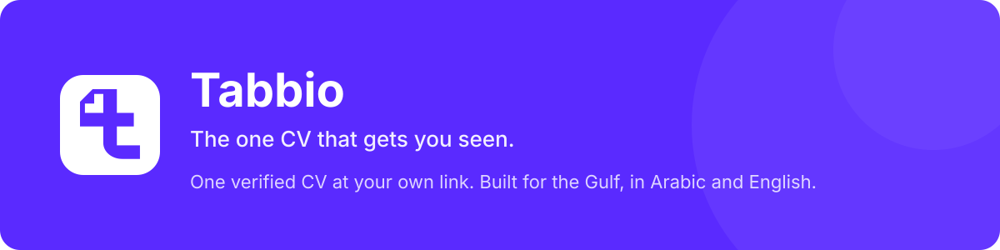

<strong>One CV, one link, one source of truth. Verified, and read by recruiters, apps and any AI.</strong>

# Tabbio

Tabbio is the one CV that gets you seen: one verified CV at your own link that recruiters, apps, and any AI can read. Verified with UAE PASS in the UAE. Built for the Gulf, in Arabic and English. Tabbio was founded by [Ahmed AlDhraif](https://github.com/ahmedaldhraif), one of the most-followed HR voices in the UAE.

Building, sharing, and downloading your CV is free.

## What you get

| | |
|---|---|
| **One CV at your own link** | yourname.tabbio.com. Change it in one place, and that's the version everyone reads. Share the link, or download the PDF when someone insists. |
| **Verified** | Government-grade identity, starting with UAE PASS in the UAE. Real people, checked. |
| **Read by any system** | ATS-ready. Connect a verified CV to any AI: ChatGPT, Claude, Cursor, or any agent, with your permission. |
| **Arabic and English** | Full right-to-left support. Built for how hiring works in the Gulf. |
| **Jobs across the UAE and the Gulf** | Matched to your CV. Searching and applying are free. |
| **A career agent** | It finds roles, tailors your CV, prepares applications and interview prep. You approve every send. It never sends anything without you. |

## Why we exist

Most qualified people are invisible. Recruiters spend seconds on a PDF, and screening software filters it before a human ever looks. Everyone keeps about ten versions of their CV, all slightly wrong, and AI can't read any of them. Tabbio replaces the file with one link that everything reads from.

## Trust

- Verified with UAE PASS in the UAE
- Scored 91.6% on Digital Dubai's AI Ethics Self-Assessment (September 2026). Report available on request.
- Your public CV never shows your phone or email. People message you through Tabbio.
- No user data is used to train models. Full AI disclosure at [tabbio.com/ai-disclosure](https://tabbio.com/ai-disclosure)

## Get Tabbio

[Web](https://tabbio.com) · [iOS](https://apps.apple.com/app/id6755083658) · [Android](https://play.google.com/store/apps/details?id=com.tabbio.app) · [Arabic](https://tabbio.com/ar)

## Open source from Tabbio

| Repo | What it is |
|---|---|
| [tabbio-quick-guides](https://github.com/ahmedaldhraif/tabbio-quick-guides) | 20 short how-to videos, English and Arabic, with an accessible video gallery |
| [nova-studio](https://github.com/ahmedaldhraif/nova-studio) | Browser-based SVG animation and export studio for Nova, the Tabbio mascot |
| [tabbio-affiliate](https://github.com/ahmedaldhraif/tabbio-affiliate) | Affiliate partner program frontend, built on RefRef |

## Elsewhere

[tabbio.com](https://tabbio.com) · [LinkedIn](https://www.linkedin.com/company/tabbio) · [Instagram](https://www.instagram.com/tabbio) · [Founder](https://github.com/ahmedaldhraif)

Hiring? [Hire verified talent from the Gulf](https://tabbio.com/employers).

Stop sending CVs. Send your Tabbio.
